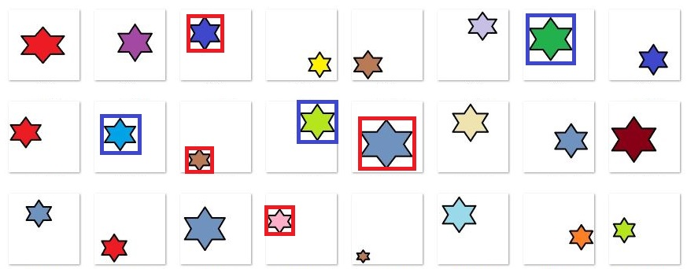

# Simple object detector using keras
very basic version of custom object detection using pre trained model.

1. Model can be trained using differenet pre trained model.
2. coordinate normlisation has been performed
3. Special relu activation is used instead of softmax for object detection
4. lower learning  rate is choosed
5. mse can be used for activation at last layer

# Implementation
step 1: annote datasets (images) labelImg.exe software
step 2: Process data sets using data_preperations.py
Step 3: run train_detector.py 

# Datasets Format:
Custom datasets created to detect star symbol with different size and locations. 

# Major Python-Libraries used:
1. tensorflow 2.3.0
3. matplotlib: 3.2.2
4. pandas: 1.0.5
5. numpy: 1.18.5

# References:
https://keras.io/api/applications/inceptionv3/
